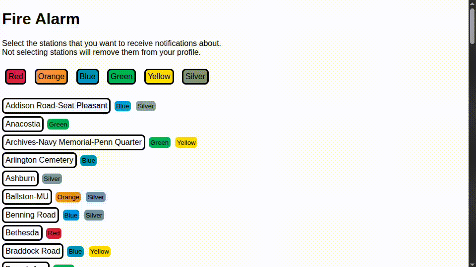

# Fire-Alarm Website

A web server for subscribing to and managing transit incident email alerts.

## Overview

The Fire-Alarm Website is a web interface that lets users subscribe to email notifications for transit incidents affecting their preferred stations. The server handles email verification, subscription management, and persists user preferences to a database.



## Prerequisites

- Rust 2024 or later
- Access to an SMTP relay server for sending verification emails
- SQL database (SQLite, MySQL, or PostgreSQL)
- A database seeded with stations and rail lines (see [parent README](../README.md))

## Installation

Clone the parent repository and build the website:

```bash
git clone https://github.com/taaki2311/fire-alarm.git
cd fire-alarm/website
cargo build --release
```

## Configuration

Configure via command-line arguments or environment variables (with the `env` feature enabled):

| Argument | Env Var | Default | Description |
| -------- | ------- | ------- | ----------- |
| `-a, --address` | `ADDRESS` | `no-reply@fire-alarm.org` | Email address to send from |
| `-n, --name` | `NAME` | Address value | SMTP relay username (optional) |
| `-p, --password` | `PASSWORD` | (required) | SMTP relay password |
| `-r, --relay` | `RELAY` | (required) | SMTP relay server URL (e.g., `smtp.gmail.com:587`) |
| `-d, --database` | `DATABASE` | (required) | Database connection URL |
| `-t, --timeout` | `TIMEOUT` | `5m` | Email verification code timeout |
| `-u, --url` | `URL` | `127.0.0.1:8080` | Server listen address and port |

### Example `.env` file

```bash
# .env
PASSWORD=your_password
RELAY=smtp.gmail.com:587
ADDRESS=alerts@example.com
DATABASE=sqlite://db.sqlite
URL=0.0.0.0:8080
TIMEOUT=5m
```

## Usage

Start the server:

```bash
cargo run --release -- \
  --password "$PASSWORD" \
  --relay "$RELAY" \
  --database "$DATABASE"
```

Or with environment variables:

```bash
cargo run --release --features env
```

The server will listen on the configured URL (default: `http://127.0.0.1:8080`).

## API

### GET `/` or `/index.html`

Serves the subscription interface. Users can:

- Enter their email address
- Select stations to monitor
- Submit to receive a verification code

### GET `/index.js`

Returns JavaScript for client-side interactivity.

### GET `/style.css`

Returns stylesheet for the web interface.

### POST `/submit_email`

Subscribe to notifications. Request body:

```json
{
  "email": "user@example.com",
  "stations": ["Metro Center", "L'Enfant Plaza"]
}
```

The server generates a one-time passcode (OTP), sends it via email, and stores a temporary entry in the database. The OTP expires after the configured timeout (default: 5 minutes).

### PUT `/update_subscription`

Confirm subscription with verification code. Request body:

```json
{
  "email": "user@example.com",
  "code": 1234
}
```

If the code matches, the subscription is persisted to the database.

### DELETE `/update_subscription`

Unsubscribe from notifications. Request body:

```json
{
  "email": "user@example.com"
}
```

## Building

```bash
# Default features (SQLite, env support)
cargo build --release

# With specific database backend
cargo build --release --features postgres
```

## Graceful Shutdown

The server handles `SIGINT` (Ctrl-C) and `SIGTERM` signals. On shutdown, it waits for pending email verifications to complete before exiting.

## Related

- **Service**: [../service/README.md](../service/README.md) — CLI tool for sending incident alerts
- **Parent README**: [../README.md](../README.md) — Project overview and setup

## License

MIT License — See [LICENSE](./LICENSE)
